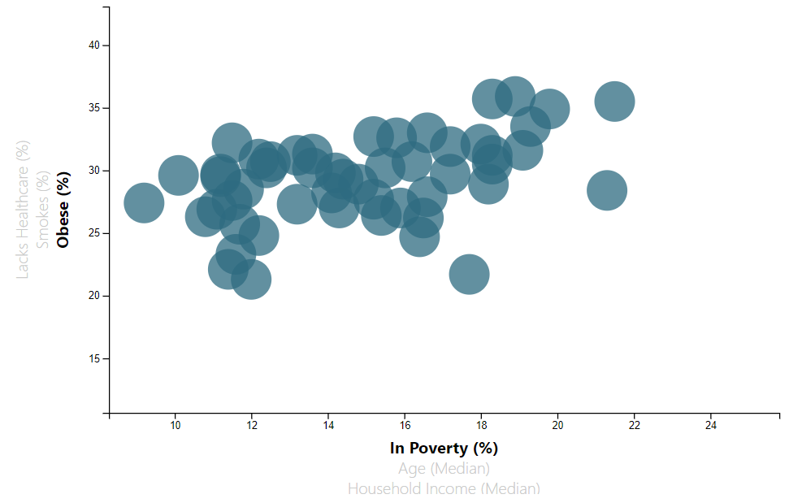
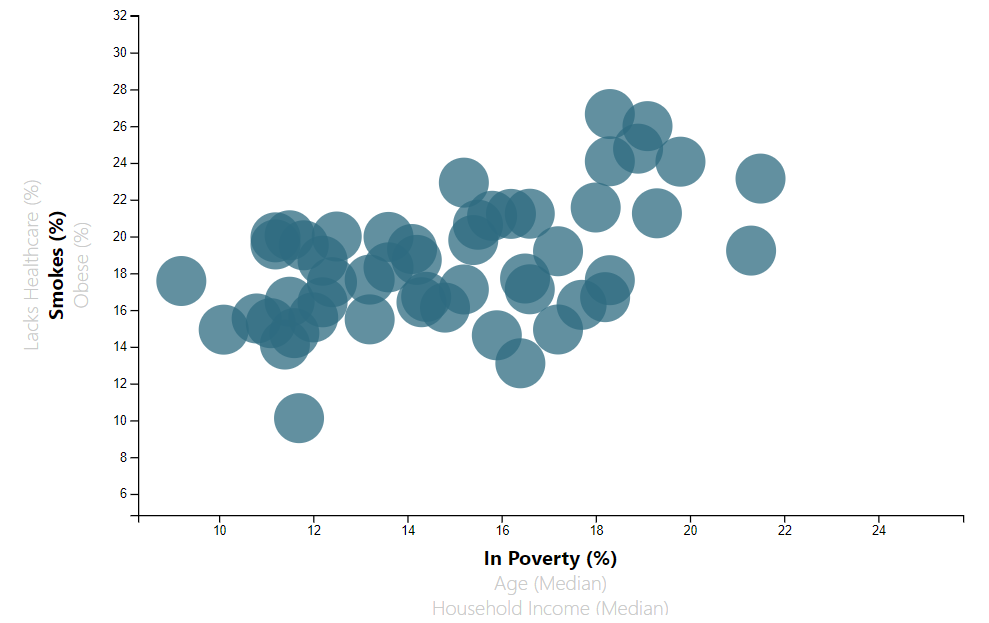

# Data Journalism and D3

In this project, We are studying the relationship between demographics and behavioral risk factors. The data was collected from the U.S. Census Bureau and the Behavioral Risk Factor Surveillance System. The circles represent the indivisual states of USA.

Some of the observble trends are:

* The Healthcare-Poverty plot suggests that the state poverty rate plays an influential role in people's ability to obtain better healthcare coverage.

* The visible trend indicates that the poorer states have higher obesity rates and greater tendencies of smoking. Wealthier states not only have higher rates of healthcare coverage, but lower obesity and smoking rates as well.

* The median age values in most US states are clustered between 30-45 years old. A close look at the plots with median age at the x-axis indicates some correlations such as: higher median age and higher healthcare coverage, lower median age and lower smoking rates, and finally, lower median age and lower obesity rates.

